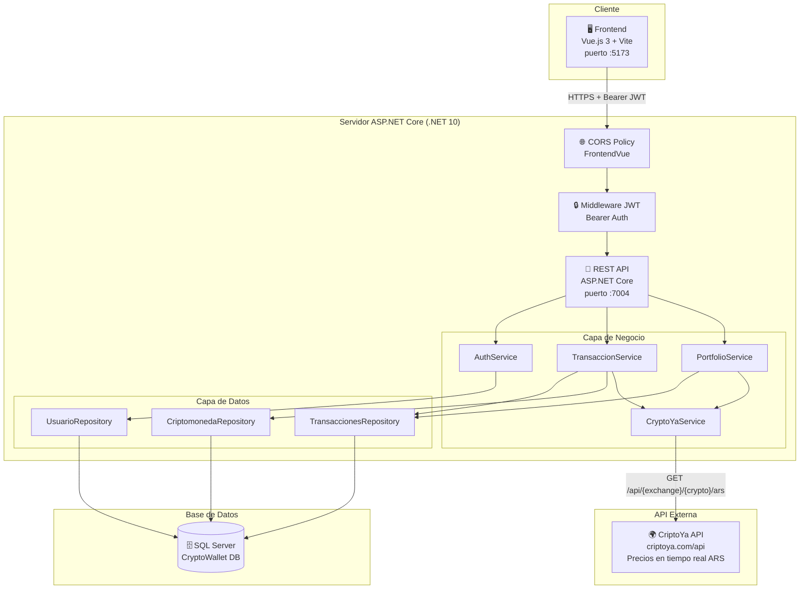
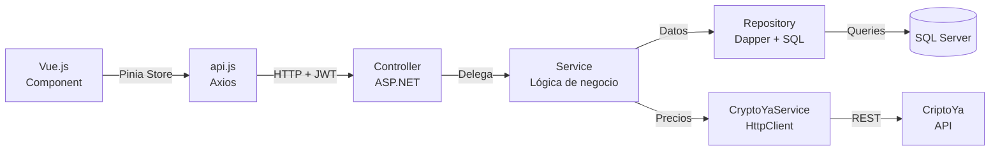
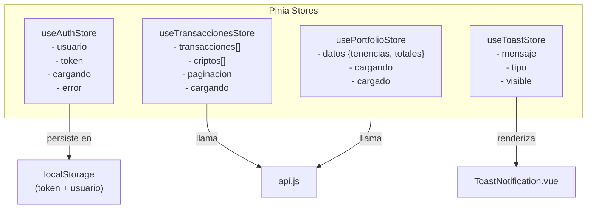
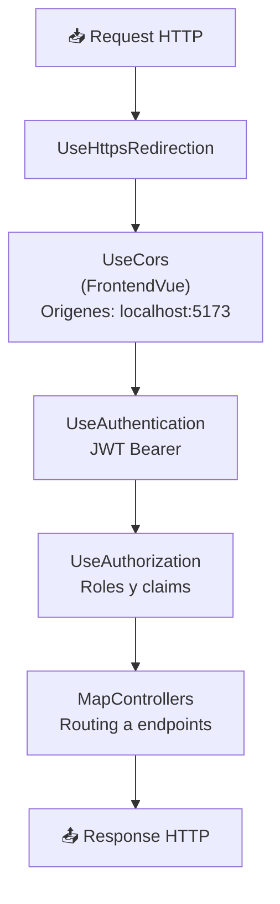
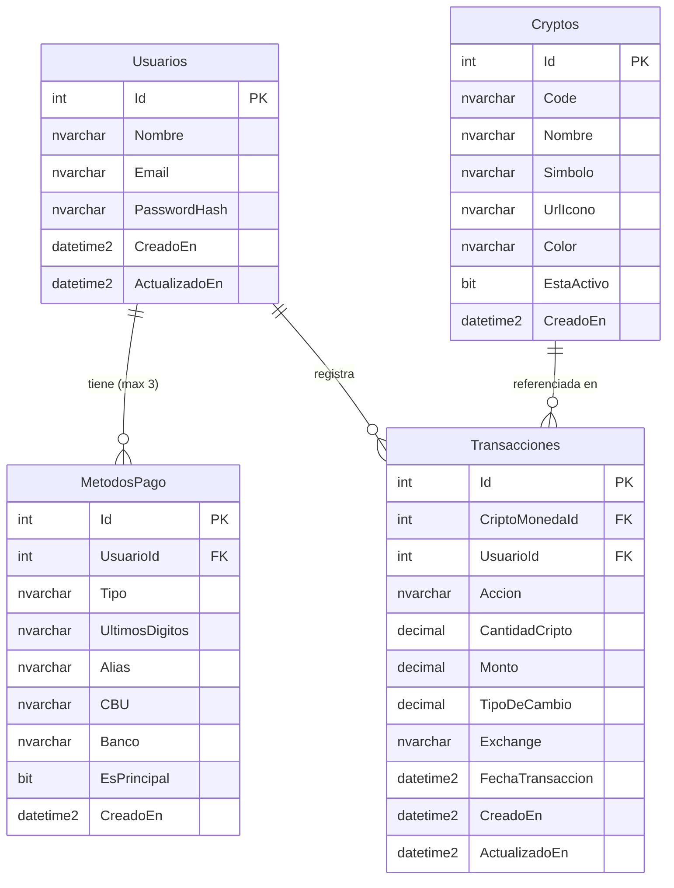
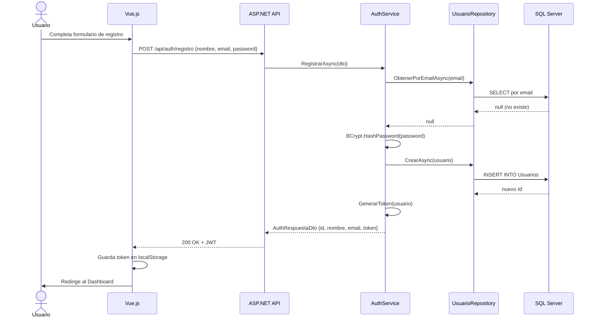
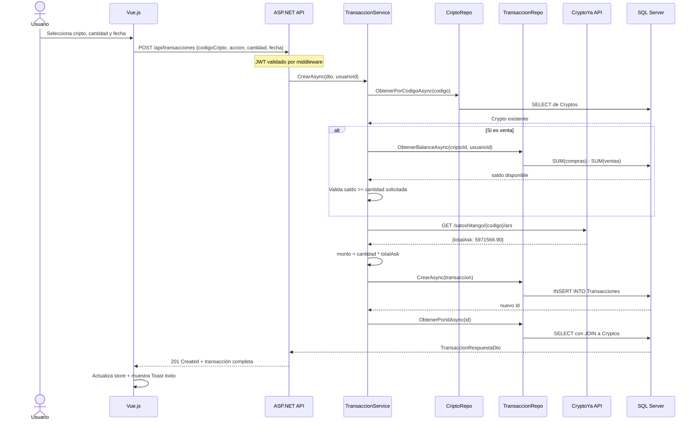
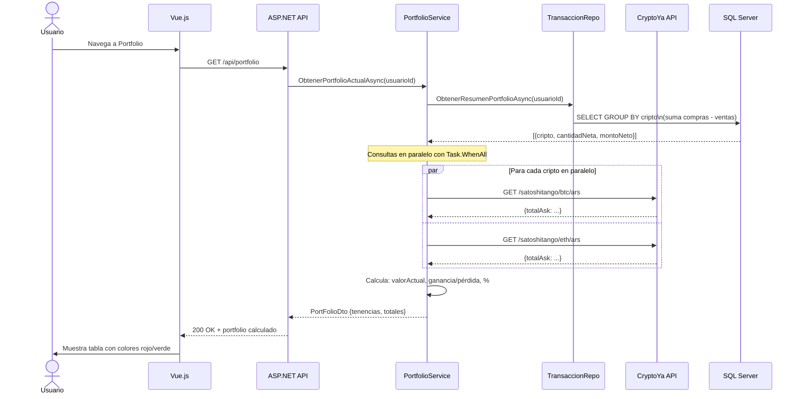
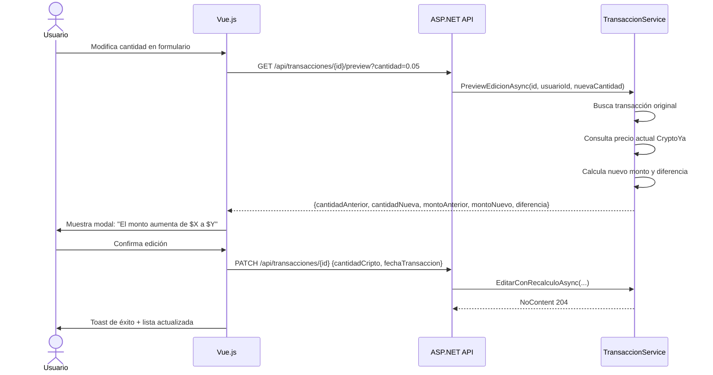

# 🪙 CryptoWallet — Documentación Técnica Profesional

> **Versión:** 5.0 | **Fecha:** Junio 2026 | **Clasificación:** Interna / Técnica  
> Documento generado por análisis arquitectónico del código fuente completo.

---

## 📋 Tabla de Contenidos

1. [Resumen Ejecutivo](#resumen-ejecutivo)
2. [Arquitectura General](#arquitectura-general)
3. [Tecnologías Detectadas](#tecnologías-detectadas)
4. [Estructura del Proyecto](#estructura-del-proyecto)
5. [Frontend — Vue.js](#frontend--vuejs)
6. [Backend — ASP.NET Core](#backend--aspnet-core)
7. [Base de Datos — SQL Server](#base-de-datos--sql-server)
8. [APIs Externas](#apis-externas)
9. [Flujos del Sistema](#flujos-del-sistema)
10. [Seguridad](#seguridad)
11. [Calidad del Proyecto](#calidad-del-proyecto)
12. [Funcionalidades Implementadas](#funcionalidades-implementadas)
13. [Mejoras Recomendadas](#mejoras-recomendadas)

---

## Resumen Ejecutivo

**CryptoWallet** es una aplicación web de gestión de cartera de criptomonedas orientada al mercado argentino. Permite a usuarios registrados registrar, visualizar y analizar sus compras y ventas de activos digitales en pesos argentinos (ARS), con precios obtenidos en tiempo real desde la API pública **CriptoYa**.

### ¿Qué hace el sistema?

El sistema actúa como un **libro de operaciones personal** para inversores de criptomonedas. El usuario registra sus transacciones (compra o venta) y el sistema calcula automáticamente el monto en ARS consultando el precio real del mercado en el momento de la operación. Adicionalmente, permite visualizar el estado actual de la cartera con ganancias y pérdidas calculadas en tiempo real.

### ¿Qué problema resuelve?

Los inversores minoristas de criptomonedas en Argentina no tienen una herramienta centralizada para:
- Llevar el historial de todas sus operaciones en un solo lugar.
- Ver cuánto vale hoy lo que compraron ayer.
- Calcular si están ganando o perdiendo en cada activo, expresado en ARS.
- Gestionar sus métodos de pago asociados.

### Usuarios del sistema

- Inversores particulares de criptomonedas en Argentina.
- Personas que operan en exchanges locales (principalmente SatoshiTango).

### Flujo principal

```
Usuario → Registro/Login → Dashboard → Registrar transacción →
Backend consulta CriptoYa → Guarda con precio real → Portfolio actualizado en tiempo real
```

---

## Arquitectura General

### Diagrama de Arquitectura



### Flujo de Capas



---

## Tecnologías Detectadas

| Categoría | Tecnología | Versión |
|-----------|-----------|---------|
| **Frontend Framework** | Vue.js | 3.5.32 |
| **Build Tool** | Vite | 8.0.8 |
| **Estado Global** | Pinia | 3.0.4 |
| **Router** | Vue Router | 5.0.4 |
| **HTTP Client** | Axios | 1.17.0 |
| **Gráficos** | Chart.js | 4.5.1 |
| **Íconos** | Lucide Vue Next | 1.0.0 |
| **Backend Framework** | ASP.NET Core | .NET 10.0 |
| **Lenguaje Backend** | C# | 13 (net10.0) |
| **ORM / Micro-ORM** | Dapper | 2.1.79 |
| **Base de Datos** | Microsoft SQL Server | Express |
| **Driver SQL** | Microsoft.Data.SqlClient | 7.0.1 |
| **Autenticación** | JWT Bearer | 10.0.9 |
| **Hash de Contraseñas** | BCrypt.Net-Next | 4.2.0 |
| **Documentación API** | Swagger / Swashbuckle | 6.9.0 |
| **Linting Frontend** | ESLint + OxLint | 10.2.1 / 1.60.0 |
| **Formateo** | Oxfmt | 0.45.0 |
| **Runtime Node.js** | Node.js | ≥20.19.0 |

---

## Estructura del Proyecto

```
CryptoWallet/
│
├── 📁 crypto-wallet-frontend/          # Aplicación Vue.js
│   ├── src/
│   │   ├── App.vue                     # Componente raíz con router-view y toast
│   │   ├── main.js                     # Bootstrap de Vue + Pinia + Router
│   │   ├── 📁 assets/
│   │   │   └── main.css               # Estilos globales (CSS variables, temas)
│   │   ├── 📁 components/
│   │   │   ├── charts/
│   │   │   │   └── PortfolioLineChart.vue  # Gráfico de evolución del portfolio
│   │   │   ├── layout/
│   │   │   │   ├── AppNavbar.vue      # Barra de navegación superior
│   │   │   │   └── AppSidebar.vue     # Menú lateral de navegación
│   │   │   └── ui/
│   │   │       └── ToastNotification.vue   # Notificaciones flotantes
│   │   ├── 📁 router/
│   │   │   └── index.js               # Definición de rutas + guards de auth
│   │   ├── 📁 services/
│   │   │   └── api.js                 # Instancia Axios centralizada + endpoints
│   │   ├── 📁 stores/                 # Stores de Pinia (estado global)
│   │   │   ├── auth.js                # Estado de sesión de usuario
│   │   │   ├── portfolio.js           # Estado de cartera
│   │   │   ├── transacciones.js       # Estado de transacciones
│   │   │   └── toast.js               # Sistema de notificaciones
│   │   └── 📁 views/
│   │       ├── DashboardView.vue      # Vista principal con resumen
│   │       ├── PortfolioView.vue      # Cartera con precios en tiempo real
│   │       ├── TransaccionesView.vue  # Historial paginado con filtros
│   │       ├── NuevaTransaccionView.vue    # Formulario de nueva operación
│   │       ├── EditarTransaccionView.vue   # Edición con preview de impacto
│   │       └── auth/
│   │           ├── LoginView.vue      # Inicio de sesión
│   │           ├── RegistroView.vue   # Crear cuenta
│   │           └── PerfilView.vue     # Perfil + métodos de pago
│   ├── package.json
│   └── vite.config.js
│
├── 📁 CryptoWallet.API/                # Backend ASP.NET Core
│   ├── Program.cs                     # Punto de entrada + configuración DI
│   ├── appsettings.json               # Cadena de conexión + configuración JWT
│   ├── 📁 Controllers/
│   │   ├── AuthController.cs          # Registro, login, perfil, métodos de pago
│   │   ├── TransaccionesController.cs # CRUD completo de transacciones
│   │   ├── PortfolioController.cs     # Portfolio actual e historial
│   │   └── CriptomonedasController.cs # Catálogo de criptomonedas
│   ├── 📁 Models/
│   │   ├── Usuario.cs                 # Entidad usuario + método de pago
│   │   ├── Transaccion.cs             # Entidad transacción
│   │   ├── Crypto.cs                  # Entidad criptomoneda
│   │   └── DTOs/
│   │       ├── AuthDtos.cs            # DTOs de autenticación
│   │       ├── TransaccionesDtos.cs   # DTOs de transacciones
│   │       └── PortFolioDtos.cs       # DTOs de portfolio calculado
│   ├── 📁 Services/
│   │   ├── AuthService.cs             # Lógica de registro/login/JWT
│   │   ├── TransaccionService.cs      # Lógica de crear/editar transacciones
│   │   ├── PortfolioService.cs        # Cálculo de cartera en tiempo real
│   │   └── CryptoYaService.cs         # Integración con API externa CriptoYa
│   └── 📁 Repositories/
│       ├── UsuarioRepository.cs       # Acceso a datos: usuarios y métodos de pago
│       ├── TransaccionesRepository.cs # Acceso a datos: transacciones y portfolio
│       └── CriptomonedaRepository.cs  # Acceso a datos: catálogo de criptos
│
└── CryptoWallet.sql                   # Script de creación de base de datos
```

---

## Frontend — Vue.js

### Componentes

| Componente | Función |
|-----------|---------|
| `App.vue` | Componente raíz; monta el router-view principal y el sistema de Toast global |
| `AppNavbar.vue` | Barra superior con nombre de usuario, botón de logout y acceso al perfil |
| `AppSidebar.vue` | Menú lateral con navegación a Dashboard, Transacciones y Portfolio |
| `PortfolioLineChart.vue` | Gráfico de líneas (Chart.js) que muestra la evolución histórica del valor en ARS |
| `ToastNotification.vue` | Notificaciones flotantes de éxito/error con auto-cierre configurable |

### Vistas (Pantallas)

| Pantalla | Descripción |
|---------|-------------|
| `LoginView.vue` | Formulario de inicio de sesión con validación y manejo de errores |
| `RegistroView.vue` | Formulario de registro de cuenta nueva |
| `DashboardView.vue` | Resumen ejecutivo: valor total del portfolio, transacciones recientes y gráfico |
| `PortfolioView.vue` | Detalle por cripto: cantidad, precio actual ARS, valor total, ganancia/pérdida |
| `TransaccionesView.vue` | Historial paginado con filtros por cripto, acción y rango de fechas |
| `NuevaTransaccionView.vue` | Formulario para registrar una nueva compra o venta |
| `EditarTransaccionView.vue` | Edición de transacción existente con preview del impacto antes de confirmar |
| `PerfilView.vue` | Datos del usuario y gestión de métodos de pago (débito, crédito, transferencia) |

### Rutas

| Ruta | Componente | Protegida |
|------|-----------|-----------|
| `/login` | `LoginView` | No |
| `/registro` | `RegistroView` | No |
| `/dashboard` | `DashboardView` | Sí |
| `/transacciones` | `TransaccionesView` | Sí |
| `/transacciones/nueva` | `NuevaTransaccionView` | Sí |
| `/transacciones/:id/editar` | `EditarTransaccionView` | Sí |
| `/portfolio` | `PortfolioView` | Sí |
| `/perfil` | `PerfilView` | Sí |
| `/` | Redirect → `/dashboard` | Sí |

El router implementa un **Navigation Guard** en `beforeEach` que verifica la presencia del token JWT en `localStorage`. Si el usuario no está autenticado y accede a una ruta protegida, es redirigido al login. Si ya está autenticado e intenta acceder a una ruta pública, es redirigido al dashboard.

### Servicios (api.js)

| Grupo | Método | Endpoint |
|-------|--------|----------|
| `transaccionesApi` | `obtenerTodas(pagina, filtros)` | `GET /transacciones` |
| `transaccionesApi` | `obtenerPorId(id)` | `GET /transacciones/:id` |
| `transaccionesApi` | `previewEdicion(id, cantidad)` | `GET /transacciones/:id/preview` |
| `transaccionesApi` | `crear(datos)` | `POST /transacciones` |
| `transaccionesApi` | `editar(id, datos)` | `PATCH /transacciones/:id` |
| `transaccionesApi` | `eliminar(id)` | `DELETE /transacciones/:id` |
| `portfolioApi` | `obtener()` | `GET /portfolio` |
| `portfolioApi` | `obtenerHistorial()` | `GET /portfolio/historial` |
| `criptosApi` | `obtenerTodas()` | `GET /criptomonedas` |
| `authApi` | `registro(datos)` | `POST /auth/registro` |
| `authApi` | `login(datos)` | `POST /auth/login` |
| `authApi` | `perfil()` | `GET /auth/perfil` |
| `authApi` | `obtenerMetodosPago()` | `GET /auth/metodos-pago` |
| `authApi` | `agregarMetodoPago(datos)` | `POST /auth/metodos-pago` |
| `authApi` | `eliminarMetodoPago(id)` | `DELETE /auth/metodos-pago/:id` |

La instancia Axios tiene dos **interceptors**:
- **Request interceptor:** inyecta automáticamente el header `Authorization: Bearer <token>` en cada petición.
- **Response interceptor:** detecta errores 401 (token expirado), limpia el localStorage y redirige al login.

### Estado Global — Pinia



| Store | Estado | Función |
|-------|--------|---------|
| `auth` | `usuario`, `token`, `cargando`, `error` | Maneja sesión del usuario. Persiste token en localStorage. |
| `transacciones` | `transacciones[]`, `criptos[]`, `paginacion` | CRUD de transacciones y lista de criptomonedas disponibles. |
| `portfolio` | `datos`, `cargando`, `cargado` | Caché del estado de cartera. Invalida con `invalidar()`. |
| `toast` | `mensaje`, `tipo`, `visible` | Sistema global de notificaciones con auto-cierre configurable. |

---

## Backend — ASP.NET Core

### Controladores

| Controlador | Responsabilidad |
|------------|----------------|
| `AuthController` | Gestión de usuarios: registro, login, perfil, métodos de pago |
| `TransaccionesController` | CRUD completo de transacciones con autorización por usuario |
| `PortfolioController` | Portfolio actual con precios en tiempo real + historial |
| `CriptomonedasController` | Catálogo de criptomonedas disponibles (público) |

### Endpoints REST

| Método | Endpoint | Auth | Descripción |
|--------|---------|------|-------------|
| `POST` | `/api/auth/registro` | No | Registrar nuevo usuario |
| `POST` | `/api/auth/login` | No | Iniciar sesión, devuelve JWT |
| `GET` | `/api/auth/perfil` | Sí | Obtener datos del usuario autenticado |
| `GET` | `/api/auth/metodos-pago` | Sí | Listar métodos de pago del usuario |
| `POST` | `/api/auth/metodos-pago` | Sí | Agregar método de pago (máximo 3) |
| `DELETE` | `/api/auth/metodos-pago/{id}` | Sí | Eliminar método de pago |
| `GET` | `/api/transacciones` | Sí | Listar transacciones paginadas con filtros |
| `GET` | `/api/transacciones/{id}` | Sí | Obtener transacción por ID |
| `POST` | `/api/transacciones` | Sí | Crear transacción (consulta precio en CriptoYa) |
| `GET` | `/api/transacciones/{id}/preview` | Sí | Previsualizar impacto de edición |
| `PATCH` | `/api/transacciones/{id}` | Sí | Editar transacción con recálculo de monto |
| `DELETE` | `/api/transacciones/{id}` | Sí | Eliminar transacción |
| `GET` | `/api/portfolio` | Sí | Portfolio actual con precios en tiempo real |
| `GET` | `/api/portfolio/historial` | Sí | Historial de valor del portfolio por fecha |
| `GET` | `/api/criptomonedas` | No | Catálogo de criptomonedas disponibles |

### Servicios

| Servicio | Función |
|---------|---------|
| `AuthService` | Registro con BCrypt hash, login con verificación, generación de tokens JWT con claims (Id, Nombre, Email). Expira en 24 horas. |
| `TransaccionService` | Lógica de negocio: valida existencia de cripto, valida saldo disponible para ventas, consulta precio a CriptoYa, calcula monto total ARS. |
| `PortfolioService` | Agrega saldo neto por cripto desde la DB, consulta precios actuales en paralelo (`Task.WhenAll`), calcula valor actual, ganancia/pérdida y porcentaje. |
| `CryptoYaService` | Cliente HTTP hacia `criptoya.com/api`. Encapsula toda la lógica de comunicación con la API externa. Usa `totalAsk` (precio real de compra con fees). |

### Modelos

| Modelo | Descripción |
|--------|-------------|
| `Usuario` | Entidad de usuario: Id, Nombre, Email, PasswordHash, fechas de auditoría |
| `MetodoPago` | Método de pago asociado a un usuario: tipo (débito/crédito/transferencia), últimos 4 dígitos o alias/CBU |
| `Transaccion` | Operación de compra o venta: cripto, usuario, cantidad, monto ARS, tipo de cambio, fecha |
| `Crypto` | Catálogo de criptomonedas: code (código CriptoYa), nombre, símbolo, URL del ícono, color hex |

### DTOs

| DTO | Sentido | Uso |
|-----|---------|-----|
| `RegistroDto` | Entrada | Datos para crear cuenta (nombre, email, password con validaciones) |
| `LoginDto` | Entrada | Credenciales de acceso |
| `AuthRespuestaDto` | Salida | Respuesta con datos del usuario + token JWT |
| `MetodoPagoDto` | Entrada | Datos para agregar método de pago |
| `MetodoPagoRespuestaDto` | Salida | Método de pago serializado |
| `CrearTransaccionDto` | Entrada | Datos de nueva transacción (sin monto — lo calcula el backend) |
| `EditarTransaccionDto` | Interno | Campos editables con recálculo |
| `EditartransaccionesSimpleDto` | Entrada | Versión simplificada para edición del usuario |
| `TransaccionRespuestaDto` | Salida | Transacción enriquecida con datos de la cripto (JOIN) |
| `PreviewEdicionDto` | Salida | Preview del impacto de la edición antes de confirmar |
| `TransaccionesPaginadasDtos` | Salida | Respuesta paginada: items + metadatos de paginación |
| `PortFolioDto` | Salida | Portfolio completo: tenencias + totales calculados |
| `PortfolioItemDto` | Salida | Una fila del portfolio: valor actual, invertido, ganancia/pérdida |
| `HistorialPortfolioDto` | Salida | Punto del historial: fecha + valor ARS en ese momento |

### Configuración de Middleware (Program.cs)



---

## Base de Datos — SQL Server

### Diagrama Entidad-Relación



### Tablas

| Tabla | Propósito |
|-------|----------|
| `Usuarios` | Almacena las cuentas de usuario. Las contraseñas se guardan como hash BCrypt, nunca en texto plano. |
| `MetodosPago` | Métodos de pago asociados a cada usuario. Máximo 3 por usuario (validado en backend). Para tarjetas solo guarda los últimos 4 dígitos. |
| `Cryptos` | Catálogo de 20 criptomonedas precargadas con sus códigos verificados contra la API de CriptoYa. |
| `Transacciones` | Registro histórico de cada compra y venta. El Monto y TipoDeCambio son calculados por el backend desde CriptoYa, nunca ingresados manualmente. |

### Relaciones

| Tabla A | Tabla B | Tipo | Detalle |
|---------|---------|------|---------|
| `Usuarios` | `MetodosPago` | 1 a Muchos | Un usuario puede tener hasta 3 métodos de pago. `ON DELETE CASCADE`. |
| `Usuarios` | `Transacciones` | 1 a Muchos | Cada transacción pertenece a un usuario específico. |
| `Cryptos` | `Transacciones` | 1 a Muchos | Cada transacción referencia una criptomoneda del catálogo. |

### Índices

| Índice | Tabla | Columna | Tipo |
|--------|-------|---------|------|
| `PK` (Id) | Todas | `Id` | Clustered |
| `IX_Transacciones_CriptoMonedaId` | Transacciones | `CriptoMonedaId` | Non-clustered |
| `IX_Transacciones_Accion` | Transacciones | `Accion` | Non-clustered |
| `IX_Transacciones_Fecha` | Transacciones | `FechaTransaccion DESC` | Non-clustered |
| `IX_MetodosPago_UsuariosId` | MetodosPago | `UsuarioId` | Non-clustered |
| `IX_Transacciones_UsuarioId` | Transacciones | `UsuarioId` | Non-clustered |
| `UNIQUE` | Cryptos | `Code` | Unique constraint |

### Constraints de Negocio en BD

- `Accion IN ('compra', 'venta')` — Solo valores válidos de tipo operación.
- `CantidadCripto > 0` — No permite cantidades negativas.
- `MetodosPago.Tipo IN ('debito', 'credito', 'transferencia')` — Tipos de pago válidos.
- `PasswordHash` nunca contiene texto plano — solo hash BCrypt.

---

## APIs Externas

### CriptoYa

| Campo | Detalle |
|-------|---------|
| **URL Base** | `https://criptoya.com/api` |
| **Endpoint consumido** | `GET /api/{exchange}/{codigo_cripto}/ars` |
| **Exchange por defecto** | `satoshitango` |
| **Objetivo** | Obtener el precio actual de una criptomoneda en pesos argentinos (ARS) |
| **Campo utilizado** | `totalAsk` — precio real de compra incluyendo fees del exchange |
| **Timeout** | 5 segundos (configurado en `HttpClient`) |
| **Gestión de errores** | Si falla, lanza excepción descriptiva. En portfolio, usa `0` como fallback para no romper el cálculo total. |

**Formato de respuesta de CriptoYa:**

```json
{
  "ask": 5912442.48,
  "totalAsk": 5971566.90,
  "bid": 5797256.86,
  "totalBid": 5739284.29,
  "time": 1626027655
}
```

---

## Flujos del Sistema

### 1. Registro de Usuario



### 2. Registro de Transacción (Compra/Venta)



### 3. Consulta de Portfolio en Tiempo Real



### 4. Edición de Transacción con Preview



---

## Seguridad

### Autenticación y Autorización

| Aspecto | Implementación |
|---------|---------------|
| **Algoritmo JWT** | HMAC-SHA256 |
| **Expiración del token** | 24 horas (configurable en `appsettings.json`) |
| **Claims del token** | `NameIdentifier` (Id), `Name`, `Email` |
| **Validaciones JWT** | Issuer, Audience, Lifetime, IssuerSigningKey (todos habilitados) |
| **Protección de endpoints** | `[Authorize]` en `TransaccionesController` y `PortfolioController` completos |
| **Aislamiento de datos** | Todos los endpoints usan `ObtenerUsuarioId()` del token — un usuario nunca puede acceder a datos de otro |

### Hash de Contraseñas

```
BCrypt.Net-Next v4.2.0
- Algoritmo: bcrypt (blowfish)
- Factor de costo: por defecto (10 rounds)
- Contraseña mínima: 8 caracteres (validado en DTO)
- Anti-enumeración: mismo mensaje de error para "email no existe" y "contraseña incorrecta"
```

### CORS

```
Política: FrontendVue
Orígenes permitidos: http://localhost:5173, https://localhost:5173
Headers: AllowAnyHeader
Métodos: AllowAnyMethod
```

⚠️ **Nota:** La política CORS está configurada solo para `localhost`. En producción debe especificarse el dominio real.

### Validaciones de DTOs

- Email: anotación `[EmailAddress]`
- Password: mínimo 8 caracteres (`[MinLength(8)]`)
- Nombre: mínimo 3 caracteres
- Acción: solo `'compra'` o `'venta'` (`[RegularExpression]`)
- CantidadCripto: mayor a 0 (`[Range(0.00000001, double.MaxValue)]`)
- Tipo de método de pago: solo `'debito'`, `'credito'` o `'transferencia'`

### Seguridad de Datos Financieros

- El **monto y tipo de cambio** nunca son enviados por el usuario — el backend siempre los calcula desde CriptoYa.
- Solo se almacenan los **últimos 4 dígitos** de tarjetas, nunca el número completo.
- Para ventas, el backend valida que el usuario tenga **saldo suficiente** antes de registrar la operación.
- La columna `PasswordHash` solo almacena el hash, nunca la contraseña en texto.
- Los métodos de pago están limitados a **máximo 3 por usuario** (validado en backend).

### Hallazgos de Seguridad

| Nivel | Hallazgo |
|-------|---------|
| ⚠️ Medio | La clave JWT (`CryptoWallet2026ClaveSecretaSegura123`) está expuesta en `appsettings.json`. En producción debe ir en variables de entorno o Azure Key Vault. |
| ⚠️ Medio | CORS abierto a `AllowAnyHeader` y `AllowAnyMethod`. Se recomienda restringir a los headers y métodos realmente utilizados. |
| ℹ️ Info | La cadena de conexión usa `Trusted_Connection=True` (autenticación Windows). Correcto para desarrollo, en producción considerar autenticación por usuario SQL con credenciales gestionadas por el SO. |
| ✅ Bien | No hay roles diferenciados pero tampoco se necesitan — toda la seguridad es por usuario autenticado. |
| ✅ Bien | El interceptor de Axios en el frontend detecta 401 y limpia la sesión automáticamente. |

---

## Calidad del Proyecto

| Aspecto | Nota | Justificación |
|---------|------|--------------|
| **Arquitectura** | 8.5/10 | Separación clara de capas (Controller → Service → Repository). Aplicación correcta del principio de responsabilidad única. Dapper elegido correctamente para un proyecto de esta escala. |
| **Frontend** | 8/10 | Composición limpia con Pinia. Buen uso de Composition API. El store de portfolio tiene un bug menor (el flag `cargado` se setea a `false` en el `finally` en lugar de `true`). |
| **Backend** | 8.5/10 | Código limpio y comentado. DTOs bien definidos. Buen manejo de excepciones en controllers. Consultas paralelas con `Task.WhenAll` en PortfolioService. |
| **Base de Datos** | 8/10 | Índices bien colocados en columnas de filtro y ordenamiento frecuente. Constraints de CHECK para integridad. La columna `UsuarioId` fue agregada con un `ALTER TABLE` post-creación (leve señal de diseño iterativo). |
| **Seguridad** | 7/10 | BCrypt correcto, JWT bien implementado, anti-enumeración de usuarios. Penaliza: clave JWT en archivo de configuración y CORS permisivo. |
| **Escalabilidad** | 6.5/10 | Arquitectura preparable para escalar, pero la conexión directa a SQL Server sin pool explícito y la ausencia de caché de precios limitan el rendimiento bajo carga alta. |
| **Mantenibilidad** | 9/10 | Código extensamente comentado en español. Nombres de variables descriptivos. Estructura de carpetas clara e intuitiva. DTOs bien documentados. Ideal para equipos junior/mid. |

**Nota global: 8.0/10**

---

## Funcionalidades Implementadas

### Módulo de Autenticación
- Registro de nuevos usuarios con validación de email único.
- Login con generación de JWT (24 horas de vigencia).
- Consulta de perfil del usuario autenticado.
- Redirección automática según estado de autenticación.
- Logout con limpieza de sesión local.

### Módulo de Transacciones
- Listado paginado de transacciones propias (20 por página).
- Filtros por: criptomoneda, tipo de acción (compra/venta) y rango de fechas.
- Creación de nueva transacción con precio calculado en tiempo real.
- Validación de saldo disponible antes de registrar ventas.
- Edición de transacciones con preview del impacto antes de confirmar.
- Eliminación de transacciones.
- Visualización de datos enriquecidos (nombre, símbolo, ícono y color de la cripto).

### Módulo de Portfolio
- Resumen de cartera: valor total en ARS, total invertido, ganancia/pérdida global y porcentaje.
- Detalle por criptomoneda: cantidad neta, precio actual, valor actual y P&L individual.
- Historial de valor del portfolio a lo largo del tiempo.
- Gráfico de líneas con evolución histórica (Chart.js).
- Actualización de precios en paralelo para minimizar tiempo de respuesta.

### Módulo de Perfil
- Visualización de datos personales.
- Gestión de métodos de pago: agregar tarjeta débito, crédito o datos de transferencia bancaria.
- Límite de 3 métodos de pago por usuario.
- Eliminación de métodos de pago.
- Almacenamiento seguro (solo últimos 4 dígitos de tarjetas).

### Catálogo de Criptomonedas
- 20 criptomonedas precargadas con información visual (nombre, símbolo, ícono, color).
- Códigos verificados contra la API de CriptoYa para garantizar la compatibilidad.
- Criptos activas/inactivas (campo `EstaActivo`).

---

## Mejoras Recomendadas

### 🔴 Alta Prioridad

**1. Mover credenciales a variables de entorno**
La clave JWT y la cadena de conexión a SQL Server están hardcodeadas en `appsettings.json`. Esto representa un riesgo de seguridad si el repositorio es público.
```
Solución: usar .NET User Secrets en desarrollo y variables de entorno en producción.
```

**2. Bug en PortfolioStore (frontend)**
En `stores/portfolio.js`, el bloque `finally` setea `this.cargado = false` en lugar de `true`, lo que provoca que el portfolio se recargue en cada visita en lugar de usar el caché.
```javascript
// Bug actual:
finally { this.cargado = false }  // ← debería ser true
```

**3. UsuarioId en Transacciones faltante en diseño original**
La columna `UsuarioId` fue añadida a `Transacciones` mediante `ALTER TABLE` en lugar de estar en el diseño inicial. Esto indica que fue incorporada posteriormente. El script SQL incluye un `UPDATE` que asigna `UsuarioId = 1` a todas las transacciones existentes, lo cual es correcto como migración pero debe documentarse.

### 🟡 Media Prioridad

**4. Caché de precios de CriptoYa**
Cada carga del portfolio realiza N llamadas HTTP externas (una por cripto). Bajo carga alta esto puede ser lento o causar rate limiting. Se recomienda un caché en memoria (IMemoryCache) con TTL de 30-60 segundos.

**5. CORS restrictivo para producción**
La política actual permite cualquier header y método. En producción, debe limitarse a los métodos HTTP reales: `GET`, `POST`, `PATCH`, `DELETE`.

**6. Paginación en Transacciones — verificar `UsuarioId` en filtros**
El filtro de paginación en `TransaccionesRepository` debe asegurarse de que siempre filtre por `UsuarioId` en todas las queries de conteo y listado, para evitar fugas de información entre usuarios.

**7. Timeout del portfolio en el cliente**
El endpoint de portfolio tiene un timeout de 20 segundos en el frontend (`portfolioApi.obtener()`), que es considerablemente mayor al timeout de 5 segundos del `HttpClient` de CryptoYaService. Estas configuraciones deberían estar alineadas.

### 🟢 Baja Prioridad

**8. Tests unitarios**
El proyecto carece de tests automatizados. Se recomienda agregar pruebas unitarias para `TransaccionService` (especialmente la validación de saldo) y `AuthService` (registro con email duplicado).

**9. Logs estructurados**
Actualmente los errores se loguean con `_logger.LogError`/`LogWarning` en `CryptoYaService`. Se recomienda extender el logging a todos los servicios y agregar un identificador de correlación para facilitar el debugging en producción.

**10. Dockerización**
No existe `Dockerfile` ni `docker-compose.yml`. Añadirlos facilitaría el despliegue en cualquier entorno y garantizaría la reproducibilidad del entorno de desarrollo.

**11. Manejo de criptos inactivas**
Existe el campo `EstaActivo` en la tabla `Cryptos` pero no se filtra en el frontend al mostrar el selector de criptomonedas. Una cripto marcada como inactiva debería ocultarse del formulario de nueva transacción.

---

## Anexo — Variables de Configuración

| Variable | Archivo | Valor actual | Ambiente |
|----------|---------|-------------|---------|
| `ConnectionStrings:Conexion` | `appsettings.json` | `Server=AGUS\SQLEXPRESS;Database=CryptoWallet;...` | Dev |
| `Jwt:Clave` | `appsettings.json` | `CryptoWallet2026ClaveSecretaSegura123` | ⚠️ Cambiar en Prod |
| `Jwt:Emisor` | `appsettings.json` | `CryptoWalletAPI` | Ambos |
| `Jwt:Audiencia` | `appsettings.json` | `CryptoWalletFrontend` | Ambos |
| `Jwt:ExpiracionHoras` | `appsettings.json` | `24` | Ambos |
| `baseURL` (Axios) | `src/services/api.js` | `https://localhost:7004/api` | ⚠️ Cambiar en Prod |

---

*Documentación generada mediante análisis estático completo del código fuente — CryptoWallet v5.0 — Junio 2026*
